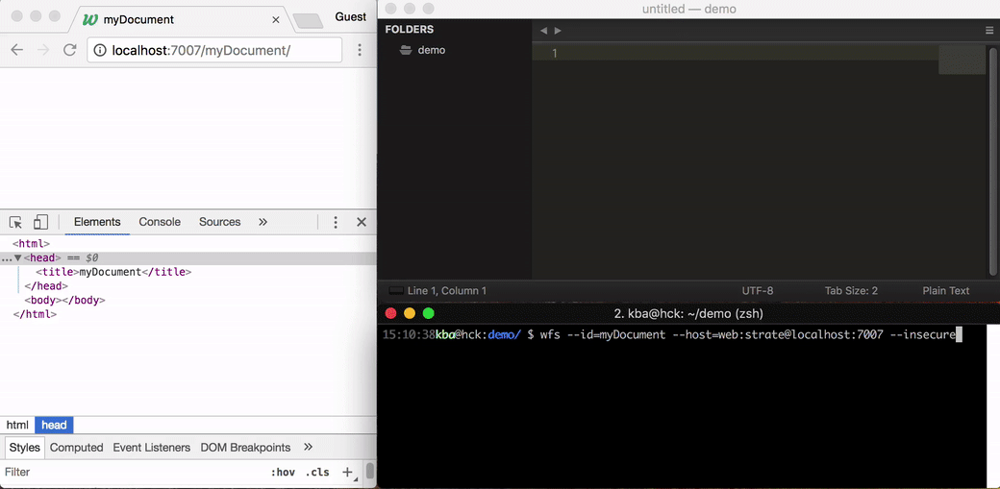

# Webstrates File System

Webstrates File System allows you to mount a webstrate as a folder on the disk, automatically propagating changes between the folder and its files to the webstrate document on the server.

## Installation

**Using NPM (recommended)**

    npm install -g webstrates-file-system

**Using Git**

    git clone git@github.com:Webstrates/file-system.git

## Usage

If installed using NPM, run from anywhere:

    wfs --id=<webstrateId> --host=<host> [<folder>]

(On Windows, `wfs` will conflict with Windows Fax and Scan. Instead, use `webstratesfs`.)

If installed using Git, navigate to the `Webstrates-file-system/` folder and run

    node index.js --id=<webstrateId> --host=<hostname> [<folder>]

When running the command, a folder with name `<webstrateId>` will be created with an `index.html` file, containing the webstrate document's contents. If the optional `<folder>` parameter has been passed, this will be used as the folder name instead.

**Credentials**

By default, the Webstrates server [uses basic auth with username "web" and password "strate"](https://webstrates.github.io/userguide/server-config.html#basic-settings). To use this with webstrate, add it to the host as:

    $ wfs --id=myDocument --host=web:strate@hostname

**HTTP or HTTPS**

WFS assumes the server is using HTTPS. To use HTTP, apply the `--insecure` parameter.

**Assets**

Any file added to the `assets/` folder will be uploaded to the Webstrates server when WFS is running, assuming it isn't already on the server and accessible. "Accessible" here means that it hasn't been overwritten by a newer version on the server. E.g. if version 1 of `cow.png` gets uploaded, and we put version 1 of `cow.png` in the `assets/` folder, it will not get uploaded. If, however, version 2 of `cow.png` has been uploaded after version 1, and version 1 is added to the `assets/` folder, version 1 of `cow.png` will get reuploded.

(Side note: Do not worry too much about wasting space – the Webstrates server deduplicates identical files.)

**Resources in external files**

When adding an `id` attribute to a `

to `index.html`, the contents will be removed from the `<script>` tag in `index.html` and instead be put in `resources/test.js`. Any changes made to `test.js` will automatically be synchronized with the Webstrates server (both ways as per usual). To the server, the script will appear in-lined as per usual.

**Ours and theirs**

When connecting to a webstrate document using a folder already containing an `index.html` file, the local version on the disk will be pushed to the server. To use the version on the server instead, use `--theirs`.

**One-shot**

To use WFS only as a deployment tool, the `--oneshot` parameter can be used. This composes the resources and the `index.html`, updates the document on the server and terminates.

NB: Remember to set up your editor to auto-reload the file on changes.

**Downloading assets**

By default, files found in the `assets/` folder are uploaded, but existing assets from the server aren't downloaded. When using `--download-assets`, WFS will download (the newest version of) all assets on the server when connecting and continuously listen for new assets and download them as well to maintain a local copy.

## How?

The brief story: WFS creates a websocket to the Webstrates server, acting exactly as a regular Webstrates client. When the document comes in (or any updates to it), the JsonML document gets converted to HTML (like when accessing a Webstrate document with the [`?raw` parameter](https://webstrates.github.io/userguide/http-api.html#accessing-the-history-of-a-webstrate)) and put it in a file. WFS listens for changes to the file, converts the HTML back to JsonML, calculates an [op diff between the two JsonML structures](https://github.com/kbadk/json0-ot-diff) and submits it to the server.